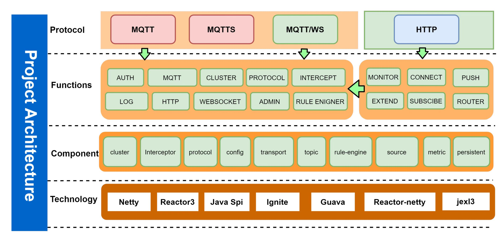

<h1 align="center">SMQTTX</h1>


<p align="center">

<a href=" https://github.com/quickmsg/smqttx/blob/release/ignite/README.md">

</a>

<a href=" https://projectreactor.io/docs/netty/release/reference/index.html">

</a>

<a href=" https://projectreactor.io/docs/core/release/reference/">

</a>

<a href="">

</a>

<a href=" https://projectreactor.io/docs/netty/release/reference/index.html">

</a>

</p>


<div align="center">

<strong>

<samp>

[English](README-EN.md) · [Simplified Chinese](README.md)


</samp>

</strong>

</div>


## Function list


<details>
<summary>Click I open/close the function list</summary>

- [Standard MQTT Protocol](#Internationalization)
- [Websocket Protocol](#ContentDirectory)
- [TLS/SSL Encryption](#ContentDirectory)
- [Service Level](#ProjectIntroduction)
  - [qos0 at most once](#OfficialAebsite)
  - [qos1 at least once](#OfficialAebsite)
  - [qos2 only once](#OfficialAebsite)
- [Topic Filtering](#GraphicDemo)
  - [# Multi level matching](#fficialwebsite)
  - [+first level matching](#officialwebsite)
- [Reserved Message](#Function)
- [HTTP Protocol](#Schema)
- [Interceptor](#QuickStart)
- [Metrics Health](#QuickStart)
- [Rule Engine](#Maintainer)
- [Rule Management](#OfficialWebsite)
- [Data source management](#officialWebsite)
- [Cluster](#Maintainer)
- [Distributed Cluster Routing](#Maintainer)
- [Distributed Node Dynamic Discovery](#Maintainer)
- [Distributed Job](#Maintainer)
- [Cluster Kick Off Strategy](#Maintainer)
- [SMQTTX Management Platform](#QuickStart)
- [SpringBoot Starter](#Contributor)
- [Apacche 2](#License)

</details>


## Project introduction




Java based distributed MQTT message proxy server for Internet of Things


### Official website


[Official website address]（ https://www.smqtt.cc )


### Background

The distributed MQTT cluster is implemented based on Netty, and provides fast access and configuration capabilities. It provides a unified access management platform. It can complete the access of tens of millions of devices without complex configuration.


## Quick Start


[]( https://www.smqtt.cc )


### Dependency

```xml

<dependency>
  <artifactId>smqttx-spring-boot-starter</artifactId>
  <groupId>io.github.quickmsg</groupId>
  <version>2.0.7</version>
</dependency>
        <!--Mask h2 database version conflicts-->
<dependency>
<groupId>com.h2database</groupId>
<artifactId>h2</artifactId>
<version>1.4.197</version>
</dependency>
```
### Config
application.yaml add config:

[config](config/config.yaml)

### Start
Add on the SpringBootApplication startup class

`@EnableMqttServer ', and then start the service


Please check config you want:


| File Name      | Style Preview|
|----------------|----------------------------------------------------------------------------------------------------|
| -----------    |-----------------------------------------------------|
| mqtt config    | https://wiki.smqtt.cc/smqttx/mqtt/1.mqtt.html       |
| acl config     | https://wiki.smqtt.cc/smqttx/acl/1.acl.html         |
| auth config    | https://wiki.smqtt.cc/smqttx/auth/1.auth.html       |
| http config    | https://wiki.smqtt.cc/smqttx/http/1.http.html       |
| ws config      | https://wiki.smqtt.cc/smqttx/ws/1.ws.html           |
| cluster config | https://wiki.smqtt.cc/smqttx/cluster/1.cluster.html |
| ssl/tls config       | https://wiki.smqtt.cc/smqttx/ssl/1.ssl.html         |


## Maintainer


Thanks to the maintainers of these projects:

<a href=" https://github.com/1ssqq1lxr ">


</a>


<details>

<summary>Click I Open/Close Maintainer List</summary>


- [MetaQ]( https://github.com/1ssqq1lxr ）- SMQTTX project maintainer.

</details>[


## Contributors


Thank all the contributors who participated in the development of SMQTTX. [List of contributors]（ https://github.com/quickmsg/smqttx/graphs/contributors )


## Components


- [Reactor-Netty]( https://projectreactor.io/docs/netty/release/reference/index.html ）- High performance network framework

- [Reactor3]( https://projectreactor.io/docs/core/release/reference/ ）- Reactive framework implementation based on Reactor3

- [Ignite]( http://ignite-service.cn/ ）- High performance distributed network service cache

- [WebSite]( https://www.smqtt.cc ）- Project official website

- [Wiki]( https://wiki.smqtt.cc ）- Project documentation


## License

[License APACHE 2.0](LICENSE)

## Contact We
Add WeChat `17512575402` 