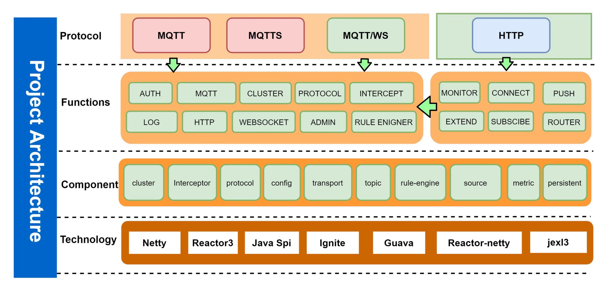

<h1 align="center">SMQTTX</h1>

<p align="center">
  <a href="https://github.com/quickmsg/smqttx/blob/main/LICENSE">
    
  </a>
  <a href="https://projectreactor.io/docs/netty/release/reference/index.html">
    
  </a>
  <a href="https://projectreactor.io/docs/core/release/reference/">
    
  </a>
  <a href="https://ignite.apache.org/">
    
  </a>
  <a href="https://docs.oasis-open.org/mqtt/mqtt/v3.1.1/mqtt-v3.1.1.html">
    
  </a>
  <a href="https://github.com/quickmsg/smqttx/releases">
    
  </a>
  <a href="https://www.oracle.com/java/technologies/javase/jdk21-archive-downloads.html">
    
  </a>
</p>


<div align="center">

<strong>

<samp>

[English](README-EN.md) · [Simplified Chinese](README.md)


</samp>

</strong>

</div>


## ✨ Core Features

<details>
  <summary>📋 Click to expand complete feature list</summary>

### 🚀 Protocol Support
- **Standard MQTT Protocol** - Full support for MQTT 3.1.1 & 5.0 protocols
- **WebSocket Protocol** - WebSocket-based MQTT communication
- **TLS/SSL Encryption** - Secure encrypted communication
- **HTTP Protocol** - HTTP interface management

### 🎯 Quality of Service
- **QoS 0** - At most once delivery
- **QoS 1** - At least once delivery  
- **QoS 2** - Exactly once delivery

### 🔍 Advanced Features
- **Topic Filtering** - Wildcard matching support
  - `#` Multi-level wildcard
  - `+` Single-level wildcard
- **Retained Messages** - Message persistence and republishing
- **Interceptors** - Custom message processing logic
- **Metrics Monitoring** - Comprehensive performance monitoring

### ⚙️ Rule Engine
- **Rule Management** - Flexible business rule configuration
- **Data Source Management** - Multiple data source integration
- **Real-time Computing** - Stream data processing

### 🌐 Distributed Architecture
- **Cluster Support** - High-availability distributed deployment
- **Dynamic Routing** - Intelligent message routing strategy
- **Node Discovery** - Automated cluster management
- **Distributed Jobs** - Cluster task scheduling
- **Load Balancing** - High-performance load distribution

### 🎮 Management Platform
- **Web Management UI** - Intuitive visual management
- **SpringBoot Integration** - Simplified development integration
- **Monitoring Dashboard** - Real-time performance monitoring

</details>


## 📖 Project Introduction

<div align="center">
  
</div>

🌟 **SMQTTX** is a high-performance, distributed MQTT message broker server built with **Java 21**, designed specifically for IoT scenarios.

### 🏠 Official Website

- 🌐 [Project Website](https://www.smqtt.cc)
- 📚 [Documentation](https://wiki.smqtt.cc)
- 🎯 [Demo Environment](http://demo.fluxmq.com)

### 🎯 Project Background

SMQTTX builds high-performance distributed MQTT clusters based on **Reactor-Netty**, providing:

- 🚄 **Ultimate Performance** - Supports millions of concurrent connections on a single node
- 🔧 **Simple Configuration** - Out-of-the-box with minimal configuration
- 🌐 **Distributed** - Horizontal scaling, supporting millions of device connections
- 📊 **Visual Management** - Unified management platform with real-time monitoring
- 🔌 **Easy Integration** - SpringBoot Starter for one-click startup


## 🚀 Quick Start


[](https://www.smqtt.cc)


### 📦 Maven Dependency

> ✅ **Requirements:** SpringBoot >= 3.0.0, Java >= 21

```xml
<dependency>
  <artifactId>smqttx-spring-boot-starter</artifactId>
  <groupId>io.github.quickmsg</groupId>
  <version>2.1.0</version>
</dependency>
<!-- Resolve H2 database version conflicts -->
<dependency>
  <groupId>com.h2database</groupId>
  <artifactId>h2</artifactId>
  <version>1.4.197</version>
</dependency>
```
### ⚙️ Configuration

Add configuration to `application.yaml`:
```yaml
# Refer to complete configuration
# config/config.yaml
```
📋 [Full Configuration Reference](config/config.yaml)

### 🎯 Start Application

Add `@EnableMqttServer` annotation to your SpringBoot application class:

```java
@SpringBootApplication
@EnableMqttServer
public class Application {
    public static void main(String[] args) {
        SpringApplication.run(Application.class, args);
    }
}
```

### 📚 Configuration Documentation

| Module | Description | Documentation |
|--------|-------------|---------------|
| 🔧 MQTT Config | Basic MQTT service configuration | [View Docs](https://wiki.smqtt.cc/smqttx/mqtt/1.mqtt.html) |
| 🔐 ACL Config | Access control list configuration | [View Docs](https://wiki.smqtt.cc/smqttx/acl/1.acl.html) |
| 🔑 Auth Config | Authentication & authorization config | [View Docs](https://wiki.smqtt.cc/smqttx/auth/1.auth.html) |
| 🌐 HTTP Config | HTTP interface configuration | [View Docs](https://wiki.smqtt.cc/smqttx/http/1.http.html) |
| 🔌 WebSocket Config | WebSocket protocol configuration | [View Docs](https://wiki.smqtt.cc/smqttx/ws/1.ws.html) |
| 🌍 Cluster Config | Distributed cluster configuration | [View Docs](https://wiki.smqtt.cc/smqttx/cluster/1.cluster.html) |
| 🔒 SSL/TLS Config | Secure transport configuration | [View Docs](https://wiki.smqtt.cc/smqttx/ssl/1.ssl.html) |


## 👥 Maintainers

Thanks to the maintainers of this project:

<a href="https://github.com/1ssqq1lxr">
  
</a>

<details>
  <summary>📋 Click to Open/Close Maintainer List</summary>

- [MetaQ](https://github.com/1ssqq1lxr) - SMQTTX project maintainer.

</details>


## 🤝 Contributors

Thanks to all the contributors who participated in SMQTTX development. [Contributors List](https://github.com/quickmsg/smqttx/graphs/contributors)


## 🧩 Components

- [Reactor-Netty](https://projectreactor.io/docs/netty/release/reference/index.html) - High performance network framework
- [Reactor3](https://projectreactor.io/docs/core/release/reference/) - Reactive framework implementation based on Reactor3
- [Ignite](https://ignite.apache.org/) - High performance distributed network service cache
- [WebSite](https://www.smqtt.cc) - Project official website
- [Wiki](https://wiki.smqtt.cc) - Project documentation


## 💼 Commercial Version

[Commercial Demo](http://demo.fluxmq.com)  
> Contact WeChat `18510240791` for commercial version integration!

## 📄 License

[License APACHE 2.0](LICENSE)

## 📞 Contact Us
Add WeChat `17512575402` to join the discussion group 