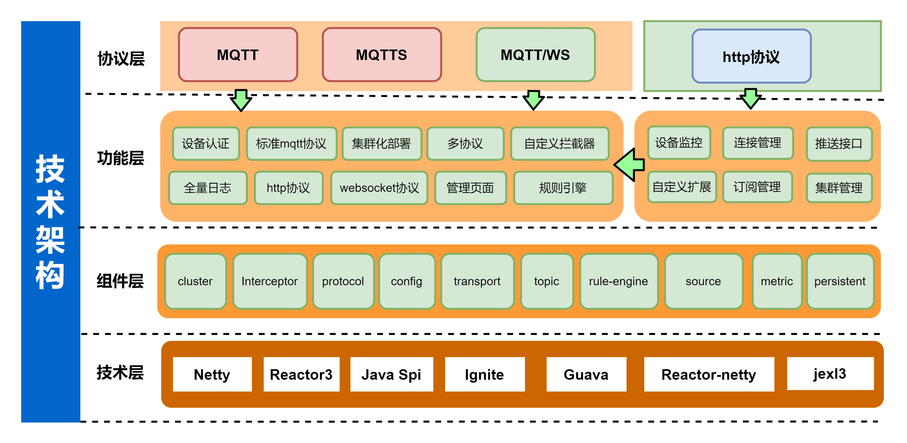

<h1 align="center">SMQTTX</h1>

<p align="center">
  <a href="https://github.com/quickmsg/smqttx/blob/release/ignite/README.md">
    
  </a>
  <a href="https://projectreactor.io/docs/netty/release/reference/index.html">
    
  </a>
  <a href="https://projectreactor.io/docs/core/release/reference/">
    
  </a>
  <a href="">
    
  </a>
  <a href="https://projectreactor.io/docs/netty/release/reference/index.html">
    
  </a>
</p>

<div align="center">
<strong>
<samp>

[English](README-EN.md) · [简体中文](README.md)

</samp>
</strong>
</div>

## 功能列表

<details>
  <summary>点我 打开/关闭 功能列表</summary>

- [标准MQTT协议](#国际化)
- [Websocket协议](#内容目录)
- [TLS/SSL加密](#内容目录)
- [服务等级](#项目介绍)
  - [qos0 至多一次](#官方网站)
  - [qos1 至少一次](#官方网站)
  - [qos2 仅仅一次](#官方网站)
- [Topic过滤](#图形演示)
  - [# 多级匹配](#官方网站)
  - [+ 一级匹配](#官方网站)
- [保留消息](#功能)
- [HTTP协议](#架构)
- [拦截器](#快速入门)
- [Metrics健康](#快速入门)
- [规则引擎](#维护者)
  - [规则管理](#官方网站)
  - [数据源管理](#官方网站)
- [集群](#维护者)
  - [分布式集群路由](#维护者)
  - [分布式节点动态发现](#维护者)
  - [分布式Job](#维护者)
  - [集群互踢策略](#维护者)
- [SMQTTX管理平台](#快速入门)
- [SpringBoot Starter](#贡献者)
- [Apacche 2](#许可证)

</details>

## 项目介绍


基于Java实现的物联网分布式MQTT消息代理服务器

### 官方网站

[官网地址](https://www.smqtt.cc)

### 背景
基于Netty实现分布式MQTT集群，并提供快速接入、配置能力，提供统一的接入管理平台，无需复杂配置，即可完成千万级别设备接入。


## 快速入门

[](https://www.smqtt.cc)

### 引入maven依赖

> SpringBoot版本>=2.7.3

```xml
<dependency>
   <artifactId>smqttx-spring-boot-starter</artifactId>
   <groupId>io.github.quickmsg</groupId>
   <version>2.0.10</version>
</dependency>
<!--屏蔽h2版本冲突-->
<dependency>
  <groupId>com.h2database</groupId>
  <artifactId>h2</artifactId>
  <version>1.4.197</version>
</dependency>
```
### 配置文件
application.yaml中添加配置：
[配置文件参考](config/config.yaml)

### 启动服务
在SpringBootApplication启动类上添加
`@EnableMqttServer` ,然后启动服务即可

**请关注一下配置文件:**

| 配置项       | 参考文档                                                |
|-----------|-----------------------------------------------------|
| mqtt配置    | https://wiki.smqtt.cc/smqttx/mqtt/1.mqtt.html       |
| acl配置     | https://wiki.smqtt.cc/smqttx/acl/1.acl.html         |
| auth配置    | https://wiki.smqtt.cc/smqttx/auth/1.auth.html       |
| http配置    | https://wiki.smqtt.cc/smqttx/http/1.http.html       |
| ws配置      | https://wiki.smqtt.cc/smqttx/ws/1.ws.html           |
| cluster配置 | https://wiki.smqtt.cc/smqttx/cluster/1.cluster.html |
| ssl/tls配置 | https://wiki.smqtt.cc/smqttx/ssl/1.ssl.html         |

## 维护者

感谢这些项目的维护者：
<a href="https://github.com/1ssqq1lxr">
  
</a>

<details>
  <summary>点我 打开/关闭 维护者列表</summary>

- [MetaQ](https://github.com/1ssqq1lxr) - SMQTTX项目维护者。

</details>

## 贡献者

感谢所有参与SMQTTX开发的贡献者。[贡献者列表](https://github.com/quickmsg/smqttx/graphs/contributors)

## 组件

- [Reactor-Netty](https://projectreactor.io/docs/netty/release/reference/index.html) - 高性能网络框架
- [Reactor3](https://projectreactor.io/docs/core/release/reference/) - 基于Reactor3的反应式框架实现
- [Ignite](http://ignite-service.cn/) - 基于高性能的分布式网络服务缓存
- [WebSite](https://www.smqtt.cc) - 项目官网
- [Wiki](https://wiki.smqtt.cc) - 项目文档

## 商业版本

[商业版演示地址](http://demo.fluxmq.com) 
> 有需要商业版接入的请添加微信`18510240791`联系我!

## 许可证

[License APACHE 2.0](LICENSE)

## 联系我们
请添加微信 `17512575402` 拉交流群