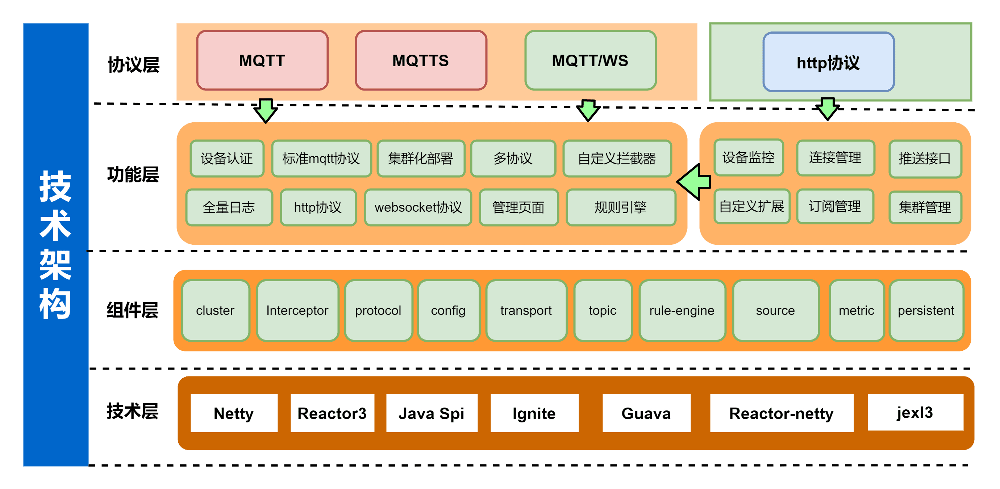

<h1 align="center">SMQTTX</h1>

<p align="center">
  <a href="https://github.com/quickmsg/smqttx/blob/main/LICENSE">
    
  </a>
  <a href="https://projectreactor.io/docs/netty/release/reference/index.html">
    
  </a>
  <a href="https://projectreactor.io/docs/core/release/reference/">
    
  </a>
  <a href="https://ignite.apache.org/">
    
  </a>
  <a href="https://docs.oasis-open.org/mqtt/mqtt/v3.1.1/mqtt-v3.1.1.html">
    
  </a>
  <a href="https://github.com/quickmsg/smqttx/releases">
    
  </a>
  <a href="https://www.oracle.com/java/technologies/javase/jdk21-archive-downloads.html">
    
  </a>
</p>

<div align="center">
<strong>
<samp>

[English](README-EN.md) · [简体中文](README.md)

</samp>
</strong>
</div>

## ✨ 核心特性

<details>
  <summary>📋 点击展开完整功能列表</summary>

### 🚀 协议支持
- **标准MQTT协议** - 完整支持MQTT 3.1.1 & 5.0协议
- **WebSocket协议** - 支持基于WebSocket的MQTT通信
- **TLS/SSL加密** - 提供安全的加密通信
- **HTTP协议** - 支持HTTP接口管理

### 🎯 服务质量
- **QoS 0** - 至多一次投递
- **QoS 1** - 至少一次投递  
- **QoS 2** - 仅一次投递

### 🔍 高级功能
- **Topic过滤** - 支持通配符匹配
  - `#` 多级匹配
  - `+` 单级匹配
- **保留消息** - 消息持久化与重发
- **拦截器** - 自定义消息处理逻辑
- **Metrics监控** - 全方位性能监控

### ⚙️ 规则引擎
- **规则管理** - 灵活的业务规则配置
- **数据源管理** - 多种数据源集成
- **实时计算** - 流式数据处理

### 🌐 分布式架构
- **集群支持** - 高可用分布式部署
- **动态路由** - 智能消息路由策略
- **节点发现** - 自动化集群管理
- **分布式任务** - 集群任务调度
- **负载均衡** - 高性能负载分发

### 🎮 管理平台
- **Web管理界面** - 直观的可视化管理
- **SpringBoot集成** - 简化开发集成
- **监控仪表板** - 实时性能监控

</details>

## 📖 项目介绍

<div align="center">
  
</div>

🌟 **SMQTTX** 是基于 **Java 21** 开发的高性能、分布式MQTT消息代理服务器，专为物联网场景设计。

### 🏠 官方网站

- 🌐 [项目官网](https://www.smqtt.cc)
- 📚 [在线文档](https://wiki.smqtt.cc)
- 🎯 [演示环境](http://demo.fluxmq.com)

### 🎯 项目背景

SMQTTX 基于 **Reactor-Netty** 构建高性能分布式MQTT集群，提供：

- 🚄 **极致性能** - 单机支持百万级并发连接
- 🔧 **简单配置** - 开箱即用，最小化配置
- 🌐 **分布式** - 支持水平扩展，千万级设备接入
- 📊 **可视化管理** - 统一管理平台，实时监控
- 🔌 **易于集成** - SpringBoot Starter，一键启动


## 🚀 快速开始

[](https://www.smqtt.cc)

### 📦 Maven依赖

> ✅ **环境要求:** SpringBoot >= 3.0.0，Java >= 21

```xml
<dependency>
   <artifactId>smqttx-spring-boot-starter</artifactId>
   <groupId>io.github.quickmsg</groupId>
   <version>2.1.0</version>
</dependency>
<!-- 解决H2数据库版本冲突 -->
<dependency>
  <groupId>com.h2database</groupId>
  <artifactId>h2</artifactId>
  <version>1.4.197</version>
</dependency>
```
### ⚙️ 配置文件

在 `application.yaml` 中添加配置：
```yaml
# 参考完整配置
# config/config.yaml
```
📋 [完整配置文件参考](config/config.yaml)

### 🎯 启动应用

在 SpringBoot 启动类上添加 `@EnableMqttServer` 注解：

```java
@SpringBootApplication
@EnableMqttServer
public class Application {
    public static void main(String[] args) {
        SpringApplication.run(Application.class, args);
    }
}
```

### 📚 配置文档

| 配置模块 | 说明 | 文档链接 |
|---------|-----|---------|
| 🔧 MQTT配置 | 基础MQTT服务配置 | [查看文档](https://wiki.smqtt.cc/smqttx/mqtt/1.mqtt.html) |
| 🔐 ACL配置 | 访问控制列表配置 | [查看文档](https://wiki.smqtt.cc/smqttx/acl/1.acl.html) |
| 🔑 Auth配置 | 认证授权配置 | [查看文档](https://wiki.smqtt.cc/smqttx/auth/1.auth.html) |
| 🌐 HTTP配置 | HTTP接口配置 | [查看文档](https://wiki.smqtt.cc/smqttx/http/1.http.html) |
| 🔌 WebSocket配置 | WebSocket协议配置 | [查看文档](https://wiki.smqtt.cc/smqttx/ws/1.ws.html) |
| 🌍 集群配置 | 分布式集群配置 | [查看文档](https://wiki.smqtt.cc/smqttx/cluster/1.cluster.html) |
| 🔒 SSL/TLS配置 | 安全传输配置 | [查看文档](https://wiki.smqtt.cc/smqttx/ssl/1.ssl.html) |

## 维护者

感谢这些项目的维护者：
<a href="https://github.com/1ssqq1lxr">
  
</a>

<details>
  <summary>点我 打开/关闭 维护者列表</summary>

- [MetaQ](https://github.com/1ssqq1lxr) - SMQTTX项目维护者。

</details>

## 贡献者

感谢所有参与SMQTTX开发的贡献者。[贡献者列表](https://github.com/quickmsg/smqttx/graphs/contributors)

## 组件

- [Reactor-Netty](https://projectreactor.io/docs/netty/release/reference/index.html) - 高性能网络框架
- [Reactor3](https://projectreactor.io/docs/core/release/reference/) - 基于Reactor3的反应式框架实现
- [Ignite](http://ignite-service.cn/) - 基于高性能的分布式网络服务缓存
- [WebSite](https://www.smqtt.cc) - 项目官网
- [Wiki](https://wiki.smqtt.cc) - 项目文档

## 商业版本

[商业版演示地址](http://demo.fluxmq.com) 
> 有需要商业版接入的请添加微信`18510240791`联系我!

## 许可证

[License APACHE 2.0](LICENSE)

## 联系我们
请添加微信 `17512575402` 拉交流群